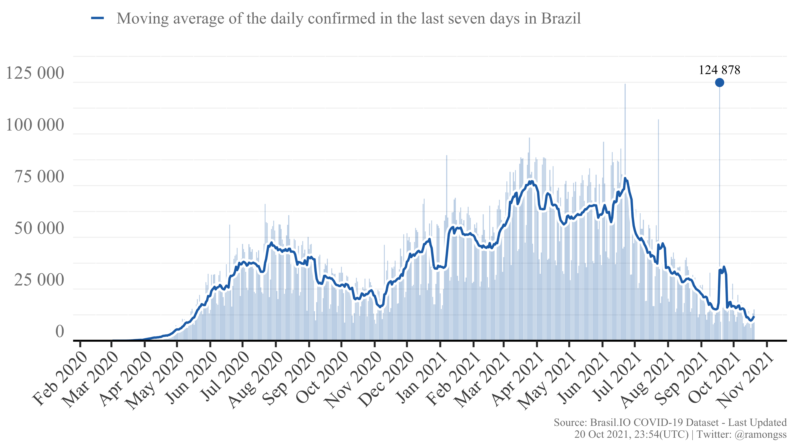

This [Github repo](https://github.com/ramongss/COVID19-AutoReports) is intended to create and daily update COVID-19 reports with confirmed cases and deaths from Brazil.

The dataset is provided by [Brasil.IO](https://brasil.io) which retrieves the daily information about COVID-19 cases from all 27 Brazilian State Health Offices, assembles and makes them publicly available. The data is daily updated and reported on the [Twitter account](https://twitter.com/brasil_io) and website.
