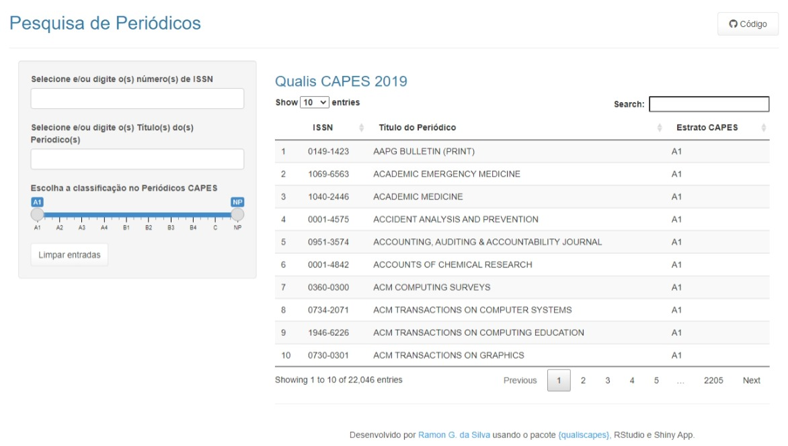

This Shiny application was made with the objective to help researches, professors, graduate, and undergraduate students from Brazil to check the preliminary 2019 Qualis CAPES list in an online platform that can be consulted any time any where.

The platform was built in Portuguese language and presents options to filter by ISSN and Title of the Periodics, and the Qualis CAPES (from A1 to NP). The table shows the Periodics that match with the filters set. To build this application, I need to create an R package called [{qualiscapes}](https://github.com/ramongss/qualiscapes), which retrieves the preliminary 2019 Qualis CAPES and organize in a dataframe. Also, I used RStudio and Shiny app to write down the codes, build, deploy, and publish the platform.

The 2019 Qualis Capes Shiny App can be found [here](https://ramongss.shinyapps.io/qualiscapes/).
